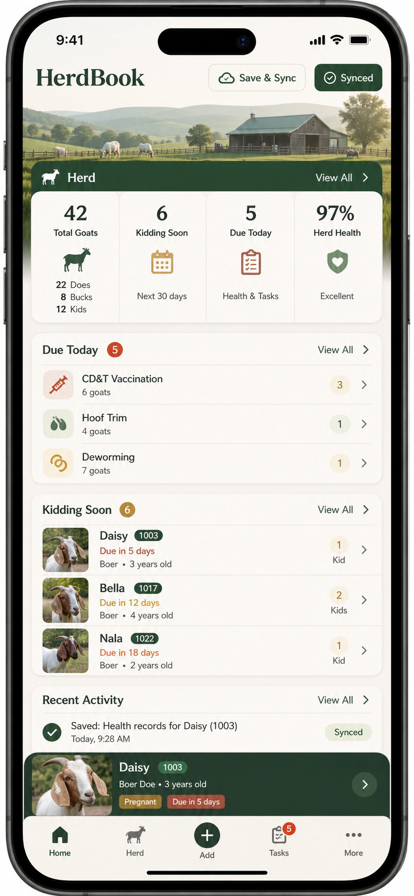

# Design Direction

## Locked Brand

- Name: HerdBook
- Icon: Open Book Goat
- Tone: practical, calm, premium, field-ready

## Visual Assets

- App icon concept: `assets/herdbook-open-book-goat-icon-concept.png`
- Mobile UI direction: `docs/design/herdbook-mobile-ui-direction.png`

## Product Feel

HerdBook should feel like a real farm operations tool, not a marketing page. The first screen is the working dashboard.

## Palette

- Deep pasture green
- Warm ivory
- Muted brass
- Charcoal text
- Terracotta alert accents
- Sage support tones

Avoid purple/blue gradients, beige-only layouts, dark slate domination, decorative orbs, and oversized hero sections.

## Layout Rules

- iPhone-first
- Dense but calm information hierarchy
- Bottom tab navigation
- Clear Save & Sync state
- Cards no more than 8px radius unless needed for app icon imagery
- No nested UI cards
- No text overlap at mobile widths
- Use direct action labels for farm workflows

## UI Reference

